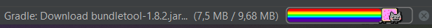

# Získávání dat z API v Android aplikaci

Tento návod Vás provede vytvořením si jednoduché Android aplikace, která bude umět získat data z daného API. Tutoriál ukazuje získávání dat z API, které vrací fakty o kočkách.

## Slovník pojmů

API - Rozhraní, které server poskytuje pro komunikaci s ním.
IDE - Vývojové prostředí (Android Studio, Intellij IDEA...)


## Klávesové zkratky

- Shift + Shift -> otevře okno pro vyhledávání souborů podle jejich názvů
- Ctrl + Shift + F -> otevře okno pro vyhledávání textu v celém projektu
- Ctrl + F -> vyhledávání textu v souboru


## Aplikace na náhodné kočičí fakty

Jako první si vytvoříte aplikaci na zobrazování náhodných kočičích faktů.

### Vytvoření aplikace

V libovolném IDE si vytvořte aplikaci s prázdnou aktivitou a počkejte až se Vám stáhnou Gradle moduly a naindexují se.



Mezitím, se můžete rozhodnout, zda budete chtít začít visuálem nebo implementací komunikace s API.

### Komunikace s API

Nejdříve si do build.gradle (ve složce app) přidejte potřebné závislosti Moshi a Retrofit.

> Pro začátečníky:
>
> Pomocí dvojitého stisku klávesy Shift se Vám otevře okno pro vyhledávání souborů v projektu. Do okna napište `build.gradle` a vyberte ten, který je popsán jako `build.gradle (:app)`. V tomto souboru najděte blok `dependencies` a vložte do něj tyto závislosti:
>
> ```groovy
> String retrofit_version = "2.9.0"
> implementation "com.squareup.retrofit2:retrofit:$retrofit_version"
> implementation "com.squareup.retrofit2:converter-moshi:$retrofit_version"
> 
> String moshi_version = '1.14.0'
> implementation "com.squareup.moshi:moshi:$moshi_version"
> implementation "com.squareup.moshi:moshi-kotlin:$moshi_version"
> ```
>
> Na prvním řádku se ukládá do proměnné požadovaná verze knihovny Retrofit (pomocí níž budete komunikovat s API) a na dalších dvou řádcích se daná knihovna importuje do projektu, abyste ji mohli používat. S Moshi je to stejně.
>
> ! Vždy je dobré si například na https://mvnrepository.com/ vyhledat používané knihovny a importovat jejich nejnovější verze. !

Po přidání závislostí spusťte Gradle synchronizaci nebo build.

V hlavním balíčku (vedle souboru `MainActivity.kt`) si vytvořte nový balíček (package), pojmenovaný `api`.  V tomto balíčku vytvořte interface `CatWebApi`.

> Pro začátečníky:
>
> Najděte si přes dvojitý Shift soubor `MainActivity.kt`, otevřete ho a vlevo v navigaci klikněte na ikonu podobnou terči (Select opened file).
>
> 
>
> Tím se Vám soubor zaměří v navigaci, kde klikněte pravým tlačítkem myši na daný soubor  -> New -> Package (pojmenovat `api`). Pak klikněte pravým na nově vytvořený package `api` -> New -> Kotlin Class/File -> Interface (pojmenovat `CatWebApi`).

V balíčku `api` budou všechny třídy zajišťující komunikaci s API. V interface `CatWebApi` definujete endpointy kočičího API. (Endpoint je koncová URL adresa. Většina API má různé endpointy pro různé požadavky.) 

Vytvořte si novou třídu `CatRequest` (podobně jako CatWebApi, jen místo Interface zvolte Class). Dokumentace kočičího API je dostupná zde https://catfact.ninja/. V dokumentaci můžete vidět, že různé endpointy přijímají různé parametry. Nejvíce parametrů přijímá endpoint `/facts`, který přijímá dva dobrovolné (max_length a limit). 
Tyto dva parametry přidáme do třídy `CatRequest`, kterou určíme jako datovou.

```kotlin
data class CatRequest(
    val max_length: Int?,
    val limit: Int?
) {
}
```

Určení třídy jako datové ji pouze zbavuje některých metod, které nebudeme potřebovat, jelikož bude použita pouze pro posílání dat. Třídě jsme přidali dvě vlastnosti, které odpovídají argumentům API. Otazník za datovým typem říká, že tyto vlastnosti nejsou povinné (mohou být null).

V dokumentaci můžete vidět, jak nám API data vrátí (co nám odpoví). Abychom tato data mohli zpracovat musíme vytvořit další třídu. Pojmenujte ji `CatFact`.

```kotlin
data class CatFact(
    val fact: String,
    val length: Int
) {
}
```

Z dokumentace víme, že API vrací fact jako String a jeho délku jako Int.

Jelikož budeme implementovat endpointy `/fact` a `/breeds`, musíme vytvořit ještě třídu `Breed`.

```kotlin
data class Breed(
    val breed: String,
    val country: String,
    val origin: String,
    val coat: String,
    val pattern: String
) {
}
```

A třídu `BreedList`, kterou nám endpoint bude vracet.

```kotlin
data class BreedList(
    val breeds: List<Breed>
) {
}
```


Vraťte se do souboru `CatWebApi`. Když máme připravené datové typy, můžeme si připravit endpointy. 

```kotlin
import retrofit2.http.Body
import retrofit2.http.GET

interface CatWebApi {
    @GET("fact")
    suspend fun getCatFact(@Body apiRequest: CatRequest): CatFact
    
    @GET("fact")
    suspend fun getCatFact(): CatFact
    
    @GET("breeds")
    suspend fun getCatBreeds(@Body apiRequest: CatRequest): BreedList
    
    @GET("breeds")
    suspend fun getCatBreeds(): BreedList
}
```

`@GET("fact")` určuje, že chceme vznést GET požadavek (https://cs.wikipedia.org/wiki/GET) na endpoint `/fact`. V deklaraci funkce říkáme, že je to asynchronní funkce, předáváme jí proměnnou typu CatRequest a očekáváme odpověď typu CatFact.


Máme připravené endpointy pro naše požadavky, teď si musíme vytvořit třídu pro zprostředkovávání komunikace s endpointy. Vytvořte si proto třídu `CatWebService`.

```kotlin
import com.squareup.moshi.Moshi
import com.squareup.moshi.kotlin.reflect.KotlinJsonAdapterFactory
import kotlinx.coroutines.CoroutineDispatcher
import kotlinx.coroutines.Dispatchers
import kotlinx.coroutines.withContext
import retrofit2.Retrofit
import retrofit2.converter.moshi.MoshiConverterFactory

const val BASE_URL = "https://catfact.ninja/"

class CatWebService (private val dispatcher: CoroutineDispatcher = Dispatchers.IO) {

    private val api:CatWebApi by lazy {
        createCatWebApi()
    }

    private fun createCatWebApi(): CatWebApi {
        val moshi = Moshi.Builder()
            .add(KotlinJsonAdapterFactory())
            .build()
        val retrofit = Retrofit.Builder().baseUrl(BASE_URL)
            .addConverterFactory(MoshiConverterFactory.create(moshi))
            .build()
        return retrofit.create(CatWebApi::class.java)
    }

    suspend fun getCatFact(length :Int? = null): CatFact {
        return withContext(dispatcher) {
            if (length == null) {
                api.getCatFact()
            } else {
                api.getCatFact(CatRequest(length, null))
            }
        }
    }

    suspend fun getCatBreeds(limit: Int? = null): BreedList {
        return withContext(dispatcher) {
            if (limit == null) {
                api.getCatBreeds()
            } else {
                api.getCatBreeds(CatRequest(null, limit))
            }
        }
    }

}
```

V této třídě jsou definovány tři metody. První  metoda, `createCatWebApi`, vytvoří objekt řídící komunikaci s API. Tato metoda se pro `lazy` inicializaci konstanty `api`. Lazy znamená, že k inicializaci dojde až při prvním použití konstanty. 

Další dvě metody slouží k volání metod definovaných v interface `CatWebApi`. Kód v bloku `withContext(dispatcher)` může být volán tak, aby neblokoval UI thread, takže aplikace může dál reagovat na uživatelovi požadavky a zároveň čekat na odpověď HTTP požadavku.

V každé této metodě musí být podmínka, jelikož když se Retrofit snaží poslat objekt se všemi argumenty s hodnotou null jako tělo (body) požadavku, vyhodí chybu. Proto také máme vytvořené dvě metody pro každý endpoint, jednu s @Body parametrem a jednu bez něj.


### Frontend

Vytvoříme si naprosto základní uživatelské prostředí pro zobrazování získaných kočičích faktů.

Otevřete soubor `activity_main.xml` a přidejte nový TextView. 

```xml
<?xml version="1.0" encoding="utf-8"?>
<androidx.constraintlayout.widget.ConstraintLayout
        xmlns:android="http://schemas.android.com/apk/res/android"
        xmlns:tools="http://schemas.android.com/tools"
        xmlns:app="http://schemas.android.com/apk/res-auto"
        android:layout_width="match_parent"
        android:layout_height="match_parent"
        tools:context=".MainActivity">
    <TextView
            android:id="@+id/textView"
            android:layout_width="wrap_content"
            android:layout_height="wrap_content"
            android:text="@string/cat_fact_default"
            app:layout_constraintBottom_toBottomOf="parent"
            app:layout_constraintStart_toStartOf="parent"
            app:layout_constraintEnd_toEndOf="parent"
            app:layout_constraintTop_toTopOf="parent"/>

</androidx.constraintlayout.widget.ConstraintLayout>
```

Jako defaultní text jsem přidal odkaz na string uložený v `strings.xml`.

```xml
<resources>
    <string name="app_name">API demo</string>
    <string name="cat_fact_default">Tap for a random cat fact!</string>
</resources>
```

Ve stejné složce, jako je soubor `MainActivity.kt` vytvořte třídu `MainActivityViewModel`.

```kotlin
import androidx.lifecycle.MutableLiveData
import androidx.lifecycle.ViewModel
import androidx.lifecycle.viewModelScope
import com.pma.api_demo.api.CatWebService
import kotlinx.coroutines.launch

class MainActivityViewModel() : ViewModel() {

    val displayText: MutableLiveData<String> = MutableLiveData()
    private val catWebService by lazy {
        CatWebService()
    }

    fun getCatFact() {
        viewModelScope.launch {
            displayText.value = catWebService.getCatFact().fact
        }
    }

}
```

Třída `ViewModel`, kterou naše třída `MainActivityViewModel` rozšiřuje, slouží pro práci s daty zobrazovanými uživatelským prostředím. Výhodu ViewModelu uvedu na příkladu. Když máte data uložená přímo v aktivitě a otočíte mobilním telefon (se zapnutým otáčením obrazovky), aktivita bude zničena a znovu vytvořena. Což pro uživatele znamená, že přijde o data uložená v aktivitě. Oproti tomu ViewModel se ničí až o něco později. Při zničení a následném vytvoření aktivity bude nová aktivita stále využívat stejný ViewModel a data v něm uložená.

Konstanta `displayText` slouží pro uchovávání získaného kočičího faktu. Její datový typ není String, ale MutableLiveData, jelikož tento datový typ posílá vždy při změně novou hodnotu všem odběratelům.

Metoda `getCatFact`  zakládá novou `coroutine` (Kotlin verze threadu nevyužívající zbytečné množství zdrojů), ve které získává kočičí fakt z námi vytvořené servisy a přiřazuje ho do `displayText`.

Nakonec upravíme třídu `MainActivity`. 

```kotlin
import androidx.appcompat.app.AppCompatActivity
import android.os.Bundle
import android.widget.TextView

class MainActivity : AppCompatActivity() {

    private val viewModel by lazy {
        MainActivityViewModel()
    }

    override fun onCreate(savedInstanceState: Bundle?) {
        super.onCreate(savedInstanceState)
        setContentView(R.layout.activity_main)
        findViewById<TextView>(R.id.textView).setOnClickListener {
            viewModel.getCatFact()
        }
        viewModel.displayText.observe(this) {
            findViewById<TextView>(R.id.textView).text = it
        }
    }
}
```

Zde přidejte konstantu pro `viewModel`. V metodě `onCreate` vytvořte `onClickListener` pro TextView, aby po kliknutí získal náhodný kočičí fakt. Nakonec definujte pozorovatele (observer) proměnné displayText viewModelu, který aktualizuje TextView kdykoli se změní hodnota této proměnné.


### Spusťte aplikaci

1) Po kliknutí na TextView by se vám po chvilce měl zobrazit náhodný kočičí fakt. 
2) V případě, že Vám aplikace spadne opravte chybu a opakujte krok 1).


## Možnosti rozšíření

- Využití i druhého definovaného endpointu.
- Umožnit uživateli nastavovat parametry, jako je délka kočičího faktu.
- Přidat další endpointy.

